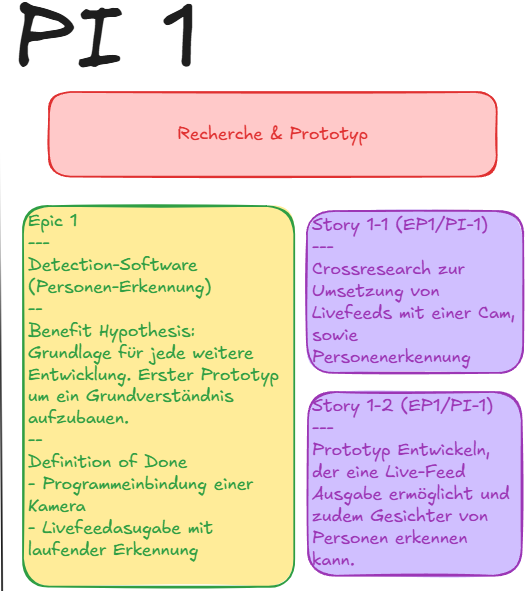

{: .text-delta }

Inhaltsverzeichnis

+ ToC
{: toc }

---

# Robocop

Im Rahmen dieses Projekts arbeitete ich in einem agilen Team von ca. 35 Leuten an dem **Robocop**. Die Konzeptentwicklung wurde in Workshop format vollzogen. Für unsere Agile Teamarbeit nutzten wir das SAFe Framework!

## Konzept PI 0

In dem Workshop von ca 7 Stunden entwickelten wir unser Konzept. Dafür spalteten wir uns in Teams auf um das Beste jedes Konzepts herauszufiltern und schlussendlich einen MVP zu bilden und Teams zu erstellen. Für all das nutzen wir die Plattform Miro.

<video 
  src="{{'/assets/videos/konzept.mp4' | relative_url }}" 
  autoplay 
  loop 
  muted 
  playsinline 
  controls
  style="max-width: 100%; height: auto;">
  Ihr Browser unterstützt das Video-Tag nicht.
</video>

### "Finales Konzept"

Der Robocop soll ein Sicherheitsroboter für Zuhause sein, der folgende Funktionen besitzen soll:

- Patroullie durch die Wohung
- Manuelle Steuerung (Durch Sprache und Remote)
- Companion App um alle Features zu nutzen
- Objekt detection (Feuer, Messer, Waffen, usw.)
- Personenerkennung mit Triggerwarnung bei Unbekannten
- Alarm Signale
- Push Benachrichtigungen für den Nutzer
- Video Playback (Aufzeichungen der Integrierten Kamera)

## Organisation

Als nächstes nutzen wir Youtrack (Ähnlich wie Jira) um uns zu organisieren. Dafür verfolgten wir Industrie gerechte Best Practices und erstellten Orte für u.A. Teampages, Design Decisions, Peer Reviews, Contributions, Agile Boards für Epics und Stories.

In dem SAFe Framework gibt es zudem das ART Team, welches haupstächlich für den flüssigen Workflow, Organisation und Kommunikation zuständig ist. Da wir mit vielen verschiedenen Teams arbeiten, entstehen natürlich auch viele Abhängigkeiten, die wir lösen mussten. Das ART unterstütze u.A. auch dabei.

Vollständige Dokumentation, System Demos nach jedem PI (Programm Increment - Ähnlich wie ein Sprint), ART Syncs (Syncronisation der Teams), Planning- und Execution Tage standen auf dem Plan.

<video 
  src="{{'/assets/videos/youtrackoverview.mp4' | relative_url }}" 
  autoplay 
  loop 
  muted 
  playsinline 
  controls
  style="max-width: 100%; height: auto;">
  Ihr Browser unterstützt das Video-Tag nicht.
</video>

## Mein Team - Person Identification

Durch mein großes Interesse in KI, gelang ich in das Team Person-Identification, in welchem ich teils Product Owner und Team Coach war. Unsere Aufgabe war es den Roboter "sehen" zu lassen und ihn zwischen bekannten und unbekannten Personen zu unterscheiden. Bei der Erkennung einer nicht zugeordneten Person werden automatisch vordefinierte Sicherheitsprotokolle aufgerufen. Durch die Integration fortschrittlicher Wahrnehmungs- und Entscheidungslogik wollten wir den Roboter zu einer realistischen Sicherheitslösung weiterentwickeln.

## Erstes Prototyping (Personenerkennung) PI 1

Im ersten Programm Increment begann ich mit Crossresearch um mir ein besseres Bild des Themas zu machen und setzte mich mit modernen Technologien aus dem Bereich Computer Vision, sowie Face Recognition Modellen auseinander. Ich sammelte Erfahrungen über OpenCV, verschiedenen Modellen wie Yolo, face_recognition und Frameworks wie Tensorflow und DLib.

Wir erstellten einen ersten Prototyp um Personen zu erkennen (Noch keine Identifizierung) mit OpenCV und Haarscascades.

<video 
  src="{{'/assets/videos/prototyp.mp4' | relative_url }}"  
  autoplay 
  loop 
  muted 
  playsinline 
  controls
  style="max-width: 100%; height: auto;">
  Ihr Browser unterstützt das Video-Tag nicht.
</video>

person_detection.py

<pre><code class="language-python">
import cv2

#Wie? HaarCascades. Haarfeatures. Es wird über ein Bild gescannt und bewertet (z.B. line positive, Kreis positive) man entscheidet sich für die Features
# Wir checken, wie viel % eines Features ein IMG hat um zu sagen ob es ein Gesicht ist

face_cascade = cv2.CascadeClassifier(cv2.data.haarcascades +
                                     "haarcascade_frontalface_default.xml")

smile_cascade = cv2.CascadeClassifier(cv2.data.haarcascades +
                                      "haarcascade_smile.xml")

eye_cascade = cv2.CascadeClassifier(cv2.data.haarcascades +
                                    "haarcascade_eye.xml")

upperbody_cascade = cv2.CascadeClassifier(cv2.data.haarcascades +
                                     "haarcascade_upperbody.xml")

def detect_features(frame):
    gray = cv2.cvtColor(frame, cv2.COLOR_BGR2GRAY)
    faces = face_cascade.detectMultiScale(gray, 1.3, 5) # min neghbours erkennung ist weniger akkurat (schlechtere quali, trotzdem erkennen anber false positives)
    bodies = upperbody_cascade.detectMultiScale(gray,1.1, minSize=(60,60), minNeighbors=3,
                                           flags=cv2.CASCADE_SCALE_IMAGE)

    for(x,y,w,h) in bodies:
        frame = cv2.rectangle(frame, (x, y), (x+w, y+h),
                              color= (255, 255, 0), thickness=5)
        upperbody= frame[ y: y+h, x: x+w] #(hier wird gedrawed)
        gray_face= gray[ y: y+h, x: x+w] # hier passiert die detection (grau wegen leistung)
        

    for(x, y, w, h) in faces:
        frame = cv2.rectangle(frame, (x, y), (x+w, y+h),
                              color= (0, 255, 0), thickness=5)
        face= frame[ y: y+h, x: x+w]
        gray_face= gray[ y: y+h, x: x+w] 
        smiles = smile_cascade.detectMultiScale(gray_face, 
                                                2.5, minNeighbors=9) 
        for(xp, yp, wp, hp) in smiles: #xp steht für xprime
            face = cv2.rectangle(face, (xp,yp), (xp+wp, yp+hp),
                                  color=(0, 0, 255), thickness= 5)
            
        eyes = eye_cascade.detectMultiScale(gray_face, 
                                                2.5, minNeighbors=7) 
        for(xp, yp, wp, hp) in eyes: 
            face = cv2.rectangle(face, (xp,yp), (xp+wp, yp+hp),
                                  color=(255, 0, 0), thickness= 5)

    return frame

# 0 macht, dass Zugriff auf die Webcam genommen wird. Hier kann auch ein Filepath zu einem Video stehen
stream = cv2.VideoCapture(1)

if not stream.isOpened():
    print("No stream :(")
    exit()

fps = stream.get(cv2.CAP_PROP_FPS)
width = int(stream.get(3))
height = int(stream.get(4))

# list of FourCC video codes: https://softron.zendesk.com/hc/en-us/articles/207695697-List-of-FourCC-codes-for-video-codecs
output = cv2.VideoWriter("assets/4_stream.mp4",
            cv2.VideoWriter_fourcc('m', 'p', '4', 'v'),  #Video speichern
            fps=fps, frameSize=(width, height))

while True:
    ret, frame = stream.read()
    if not ret: # wenn keine frames zurückgegeben werden (ret == false)
        print("Kein Stream")
        break
    
    frame = detect_features(frame) # Hier wird detected!
    output.write(frame) # video speichern
    cv2.imshow("Webcam!", frame)
    if cv2.waitKey(1) == ord('q'): # waitkey ist der delay bis der nächste frame ausgegeben wird, solange bis q gedrückt wird
        break               #waitkey erwartet einen key und gibt einen ASCII Code zurück, ord('q') verwandelt den key q zu seiem ASCII Wert. -> wenn q gedrückt wird ist der wiedergabe
                                #wert von waitkey == ASCII(q)

stream.release()
cv2.destroyAllWindows() 
</code></pre>

         

<!-- **Hardware**
Zudem machte ich mir gedanken zur Hardware und erstellte einige theoretische Techstacks die wir verwenden könnten. Dabei musste ich auf die Leistung und Komptaibilität achten, da diese Art von Software sehr Anspruchsvoll ist.

Zur Auswahl standen unter anderem  -->

## Personen Identifizierung PI 2

Im zweiten PI, standen zwei Punkte im Vordergrund. Zum einen, die Auswahl geeigneter Hardware und zum anderen, die Entwicklung einer Personen Identifizierungssoftware. Wir begannen mit der Auswahl der Hardware und mussten erstmals auf zwei wichtige Komponenten achten (Später kommt der Pan tilt Hat dazu). Die Kamera und die Rechenleistung. Zentrale Herausforderungen hierbei waren Leistung des Rechenmoduls, Kameraqualttät und Kompatibilität.

### Die Hardware

**Die Rechenleistung**
Die Design Decision für die Rechenleistungskomponente sah wie folgt aus:

*Snippet aus der Decision*

---
Zur Auswahl standen:

* Variante 1:  Raspberry Pi 4 Model B + Google Coral UBS Coral USB Accelerator
* Variante 2: Raspberry 5 (4GB oder besser 8GB)
* Variante 3: Jetson Orin Nano

|  | Var 1 (PI 4B + Coral) | Var 2 (PI 5) | Var 3 (Jetson Orin Nano) |
| --- | --- | --- | --- |
| **Leistung** | ✔️ Mit Coral USB wahrscheinlich gut | ✔️ Mit 8 GB RAM gut | ✔️ Speziell dafür ausgelegt, sehr gut |
| **Accessibility** | ✔️ Auf Lager | ❌ Nicht auf Lager | ✔️ Auf Lager |
| **Plattformunabhänigkeit** | ✔️  PI OS | ✔️ PI OS | Eigenes Ökosystem von NVIDIA (Kompatibilitätsprobleme) |

---

Wir entschieden uns wegen unserer hohen Leistungsansprüche für den Jetson Orin Nano von NVIDIA. Um diesen mit ROS1 Kompatibel zu machen, entschied ich mich ihn von Jetpack 6.x zu Jetpack 5.1.1 zu downzugraden, da die 5.1.1 geanu wie ROS1 auf Ubuntu 20.04 basiert.

**Die Cam**

Als nächstes mussten wir uns für eine Kamera entscheiden. Wir testeten die *vom Jetson Orin Nano nicht nativ unterstützte* PI Cam Module 3 mit IMX 708. Zu diesen Zeitpunkt war Jetpack 6.x auf dem Jetson geladen. Ich suchte Workarounds um die PI Cam V3 nutzen zu können jedoch ohne Erfolg. Ich durchsuchte Foren und versuchte es mit von der Comunity entwickelten Drivern. Ich versuchte es mit dem Driver von RidgeRun wobei ich den Jetson downgraden musste auf 5.x um diesen verwenden zu könnnen. Letztlich funktionierte die Cam auf dem Jetson, jedoch fehlte die Kompatibilität mit OpenCV. Das hätte mit Mühe auch funktionieren können, jedoch musste ich bereits eine eigene Pipeline für die Cam erstellen und sie u.A. auf 14 FPS begrenzen damit sie funktioniert. Da ich es nicht eingesehen habe mich so sehr einzuschränken, habe ich mich für die **PI Cam V2** entschieden und etwas Qualität eigebüßt. (Diese wird nativ unterstützt)

### Die Software

Aufbauend auf den derzeitigen Prototypens entwickelten wir ein Python Programm mit welchem wir Personen unterscheiden konnten unter Anwendung von OpenCV und der auf Dlib basierten library „face_recognition“. Diese Funktioniert Wie folgt:

1. Der Nutzer fügt ein Bild von sich in den "Bekannt" Ordner  mit seinem Namen als Dateinamen ein
2. train.py zieht alle Bilder mit der OS library aus dem Ordner (Recursive) und entimmt die Prefixes i.e. der Name ohne .jpg
3. Die Gesichter auf den Bildern werden mit Hilfe der Face_recognition library erkannt, kodiert und in einer Pickle datei gespeichert.
4. Das Model hat nun einen Code und einen Namen für alle Gesichter im Ordner. Jetzt kann facerecognizer.py ausgeführt werden
5. Ein livefeed wird mit OpenCV erstellt, jeder Frame wird geprüft und Kodiert. Die Codes aus der Pickle datei werden dann verglichen und evaluiert
6. Erkennt unser Model eine Person, wird ein Rechteck um ihr Gesicht gezeichnet mit dem richtigen Namen darüber und erkennt unser Model sie nicht, steht über dieser Person unbekannt.

### Demo

*Snippet aus der System Demo aus dem PI 2 vor dem ganzem Team*

<video 
  src="{{'/assets/videos/demo.mp4' | relative_url }}" 
  autoplay 
  loop 
  muted 
  playsinline 
  controls
  style="max-width: 100%; height: auto;">
  Ihr Browser unterstützt das Video-Tag nicht.
</video>

*Unser Team*

<video 
  src="{{'/assets/videos/team.mp4' | relative_url }}" 
  autoplay 
  loop 
  muted 
  playsinline 
  controls
  style="max-width: 100%; height: auto;">
  Ihr Browser unterstützt das Video-Tag nicht.
</video>

*Test im Kurs*

<video 
  src="{{'/assets/videos/imkurstestblured.mp4' | relative_url }}" 
  autoplay 
  loop 
  muted 
  playsinline 
  controls
  style="max-width: 100%; height: auto;">
  Ihr Browser unterstützt das Video-Tag nicht.
</video>

facerecognize.py

<pre><code class="language-python">
import face_recognition as fr
import cv2
import os
import pickle
import time
print(cv2.__version__)

fpsReport=0 # FÜr die FPS ermittlung
scaleFactor=.25 # Wir verwenden den um änderungen im gesamten Model vorzunehmen um die FPSS zu optimieren
Encodings=[]
Names= []

with open('train.pkl', 'rb') as f:
    Names=pickle.load(f)
    Encodings= pickle.load(f)

font = cv2.FONT_HERSHEY_SIMPLEX
#cam = cv2.VideoCapture('/dev/video6', cv2.CAP_V4L2) #Mit Droidcam übers handy
cam = cv2.VideoCapture(0) #Mit Webcam

fps = cam.get(cv2.CAP_PROP_FPS)
width = int(cam.get(3))
height = int(cam.get(4))
output = cv2.VideoWriter("assets/videos/rec.mp4",
            cv2.VideoWriter_fourcc('m', 'p', '4', 'v'),  #Video speichern
            fps=fps, frameSize=(width, height))

timeStamp = time.time() # Hier wird der Anfang des Loops festgehalten
while True:
    _,frame = cam.read()
    frameSmall = cv2.resize(frame,(0,0), fx=scaleFactor,fy=scaleFactor) # Frame kleiner machen für besser Leistung
    frameRGB= cv2.cvtColor(frameSmall, cv2.COLOR_BGR2RGB)
    facePositions= fr.face_locations(frameRGB, model= 'cnn') #cnn ist ein besseres Model als das Standardmäßige HOG (Simpler und langsamer), da wir den Jetson Nano haben können wir cnn nutzen
    allEncodings = fr.face_encodings(frameRGB, facePositions)
    for(top,right,bottom,left), face_encoding in zip(facePositions,allEncodings):
        name='Unkown Person'
        matches = fr.compare_faces(Encodings, face_encoding)
        if True in matches:
            first_match_index= matches.index(True)
            name=Names[first_match_index]
        top=int(top/scaleFactor)
        right=int(right/scaleFactor)
        bottom=int(bottom/scaleFactor)
        left=int(left/scaleFactor)

        cv2.rectangle(frame,(left, top), (right, bottom), (0,0,255), 2) #Left right in Opnecv ist die X achse und Top Bottom Y, in facerecognition ist das anders, deshalb können die Kästen falsch gezeichnet werden, wenn man es falsch macht
        cv2.putText(frame,name,(left,top-6),font, .75, (0,255,255),2)
    dt=time.time() - timeStamp # Jetzt nehmen wir die jetzige Zeit - die Zeit am beginn des Loops damit wir die Differenz haben
    fps= 1/dt # Wie viele Frames pro Sekunde, bsp: ein Frame jede 1/10 Sekunde, dann ist 1/(1/10)= 10 FPS
    fpsReport=.9*fpsReport + .1*fps #Low pass filter, FPS sind die gemessene Frames, die ändern sich zu sehr und springen. Wir geben dem alten Report 95% Vertrauen und dem neuen 5 %. Bei zu großen Sprüngen, bleibt der Report trotdem konstant. 
    #print('FPS: ', round(fpsReport,1))                 # Wenn die FPS hochgehen, gehen sie immer nur um 5% hoch, also wenn sie konstant oben sind, ändert sich der Report gleichmäßog und kontinuierlich
    timeStamp= time.time()
    cv2.rectangle(frame,(0,0),(100,40),(0,0,255),-1) # -1 macht das Rechteck solid
    cv2.putText(frame, str(round(fpsReport,1))+ 'fps', (0,25), font,.75, (0,255,255, 2))
    cv2.imshow('Picture', frame)
    cv2.moveWindow('Picture', 0,0)
    output.write(frame) # video speichern

    if cv2.waitKey(1)== ord('q'):
        break
cam.release()
cv2.destroyAllWindows()
</code></pre>

train.py

<pre><code class="language-python">
import pickle
import cv2
import face_recognition as fr
import os
print(cv2.__version__)

TRAIN_IMAGES_PATH='assets/trainImages'

Encodings= []  # Das ist unser Array für die Encodings, Es ist ein Array aus Arrays, da Encodings auch Arrays sind
Names= [] # Wir brauchen die Namen für die Encodings

image_dir= TRAIN_IMAGES_PATH # Die Directory unseres Known Verzeichnisses, Jetzt wollen wir da einmal durchgehen alle Bilder encoden, die Namen herausholen und die dann zusammenzuführen

for root, dirs, files in os.walk(image_dir): #mit der os Library und walk kann ich durch die Directories durchgehen | Wir laufen hier nur durch files
    print(files)
    for file in files:
        path=os.path.join(root,file)
        print(path)
        name= os.path.splitext(file)[0] # Teilt den Filenamen und nimmt die erste Postition (Nayon.JPG) der Punkt trennt die Positionen
        print(name)
        person = fr.load_image_file(path)
        encoding = fr.face_encodings(person)[0] # Gibt ein Array zurück, weil er nach mehrere Gesichter sucht und wir nehmen das erste sonst wird es ein Array in einem Array oderso
        Encodings.append(encoding)
        Names.append(name)
print(Names)

#pickle! Macht keinen Stress wegen Formaten
with open('train.pkl', 'wb') as f: # wb steht für write bytes, f ist as Objekt auf das wir zugreifen, wenn wir unser Pickle readen oder writen wollen
    pickle.dump(Names,f)
    pickle.dump(Encodings,f)
</code></pre>

       

### Das Projekt findet derzeit statt, der Rest folgt bald

## Kontakt

Bei Rückfragen oder Interesse an weiteren Informationen stehe ich gerne zur Verfügung:

---

**Vielen Dank für Ihr Interesse!**
